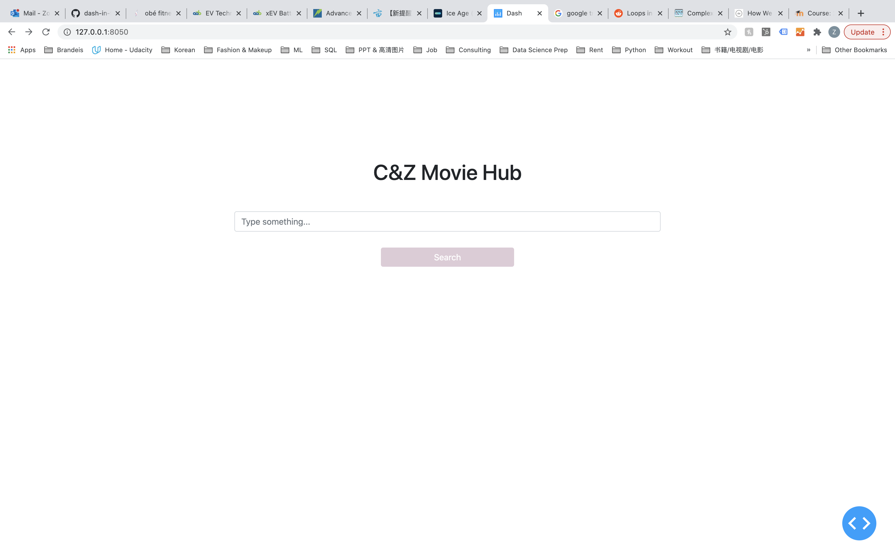
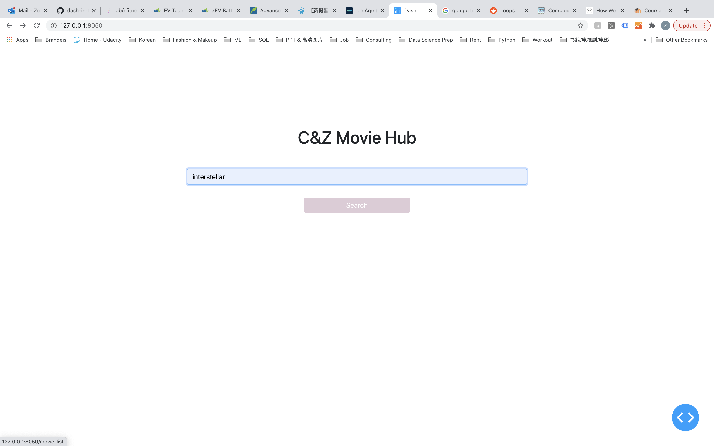
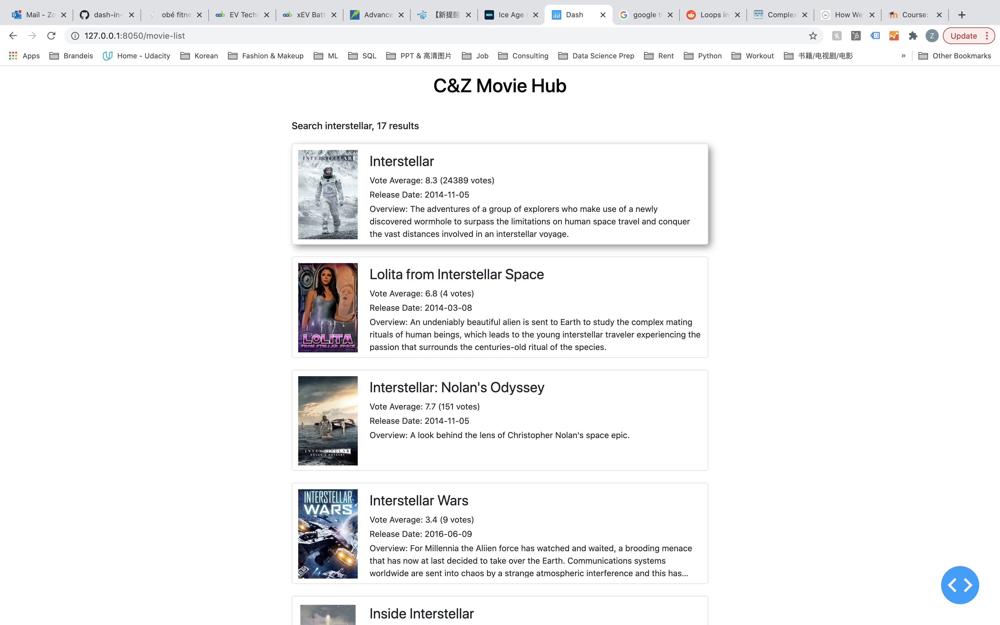
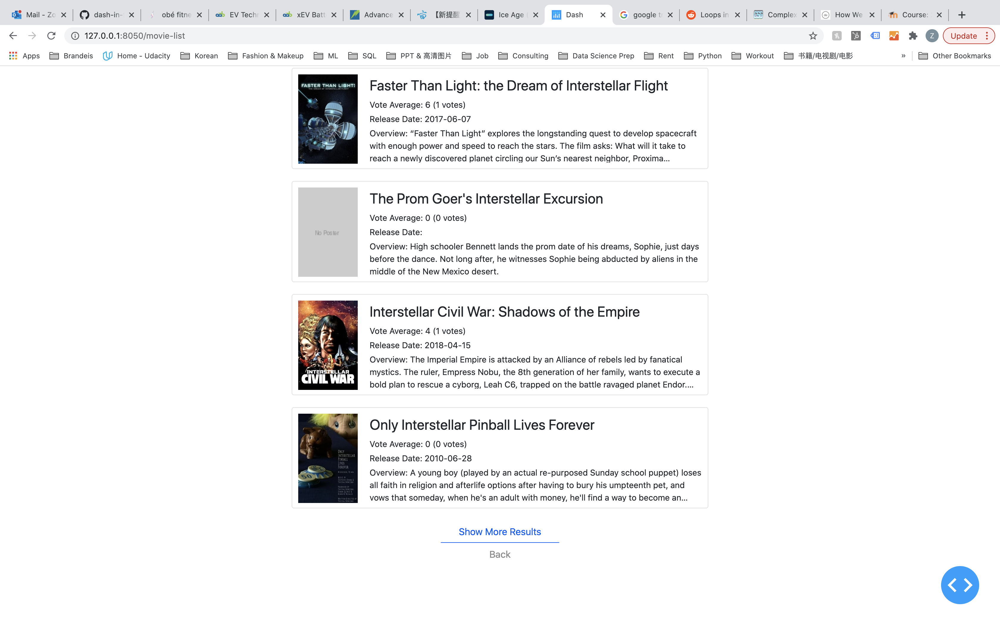
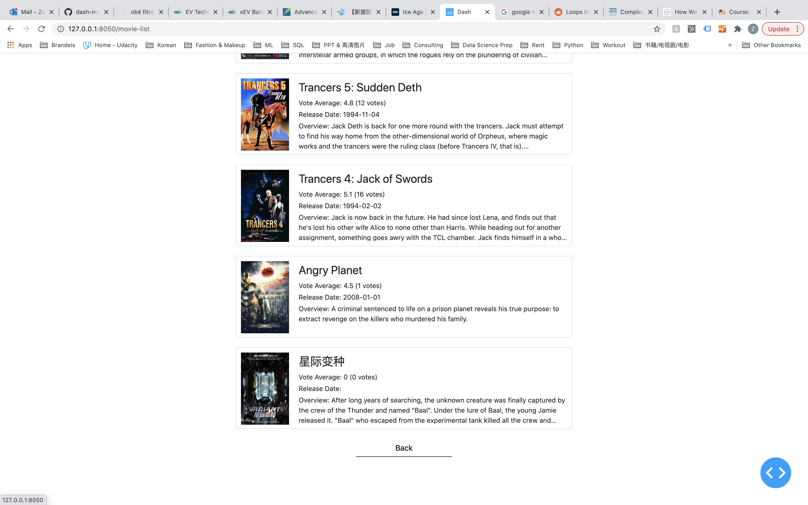
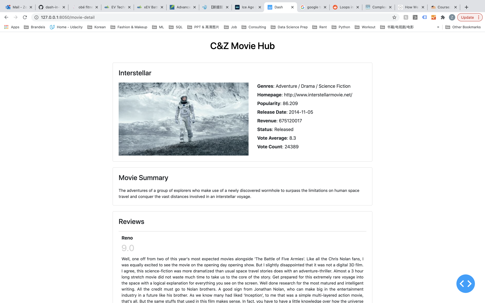
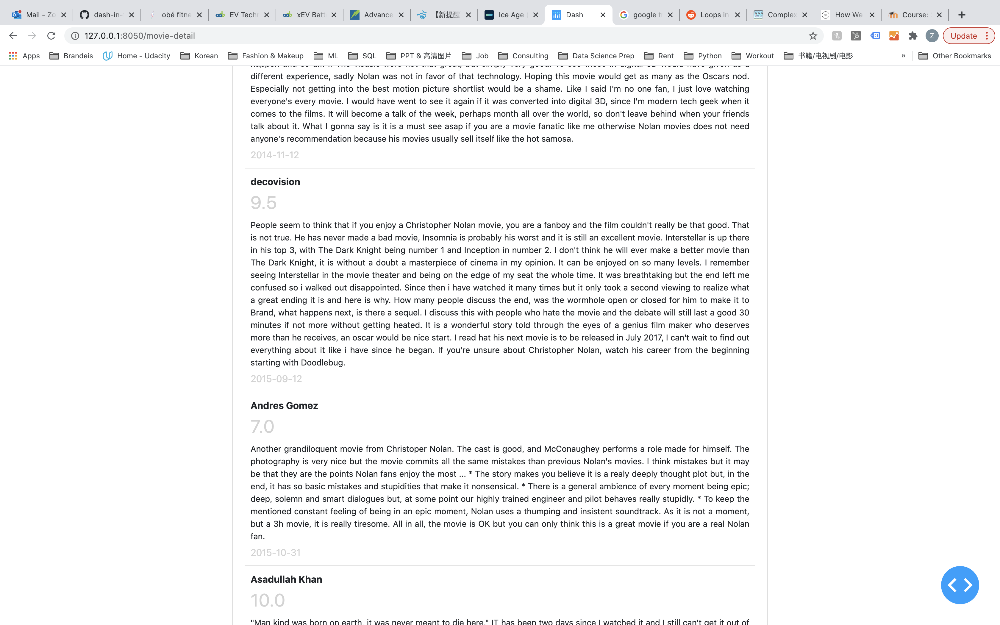

# C&Z Movie Hub (Python II Final Project)

In this era of information explosion, people are often lost during searching process because of an extravagant amount of information and illimitable links. 

Have you ever wanted to check a movie star? After entering Wikipedia, you unknowingly spent three hours learning about the movies the actor acted, his co-actors and even the box news… At the end, you might even forget who you commenced probing from, since there are an inordinate quantity of links you can click into and you are authentically trapped in Wikipedia’s loop.

In order to offer movie lovers a more straightforward user experience, Chris and I started to work on this web application project, called C&Z Movie Hub. We have utilized Python Dash to construct the website. Thanks to TMDb, we can facilely sourced movie data using its API. Unlike TMDb, we have only listed the most paramount information about the movie, such as release date, genres, vote average, vote count, popularity and movie summary to users. Besides those information, we count reviews as an important element of movie evaluation. Therefore, we integrate this function in the movie detail page. Other than that, we intentionally didn’t include any links in our website because of our minimalism concept. 

We hope you enjoy our web application. More importantly, we hope you can spend your time only on what you want to contribute to.

### How to run application locally?
```bash
pip install dash
pip install requests

git clone https://github.com/dash-in-flesh/dash-project-03.git

cd dash-project-03
python3 app.py
```

### Project Screen Shots:
#### Page 1 - Home Page



#### Page 2 - Movie List




#### Page 3 - Movie Detail Page



If you have any questions or feedbacks, please feel free to contact us. 

#### Contact Email:
zoeyang1030@outlook.com or benhuangqi@brandeis.edu
#### Author: 
Chris(Benhuang) Qi | Zoey Yang
